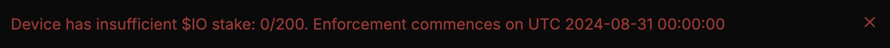

# Про стейкинг для воркеров $IO

### Зачем стейкать IO&#x20;

В контексте io.net стейкинг — это залог для получения блок ревардов. До введения стейкинга, блок реварды получали все поддерживаемые устройства.&#x20;

Теперь для получения блок ревардов нужно застейкать необходимую сумму IO, которая зависит от мультипликатора и количества карт в одном воркере.&#x20;


Сейчас io.net запускает стейкинг только для воркеров. Позже обещают сделать для всех.



Блок реварды будут капать без стейка до 31 августа.&#x20;


<figure><figcaption></figcaption></figure>

Выберите интересующий вас раздел:&#x20;


[how-stake.md](how-stake.md)



[unstake.md](unstake.md)



[calculation.md](calculation.md)



[faq.md](faq.md)


## Официальная документация

* [Блок реварды](https://docs.io.net/docs/block-rewards)
* [Стейкинг](https://docs.io.net/docs/io-staking)
* [Таблица с мультипликаторами и минимальной ставкой](https://docs.io.net/docs/proposed-device-block-reward-multiplier)
