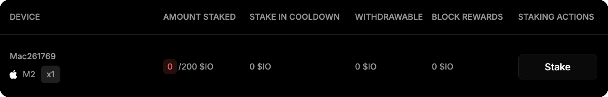
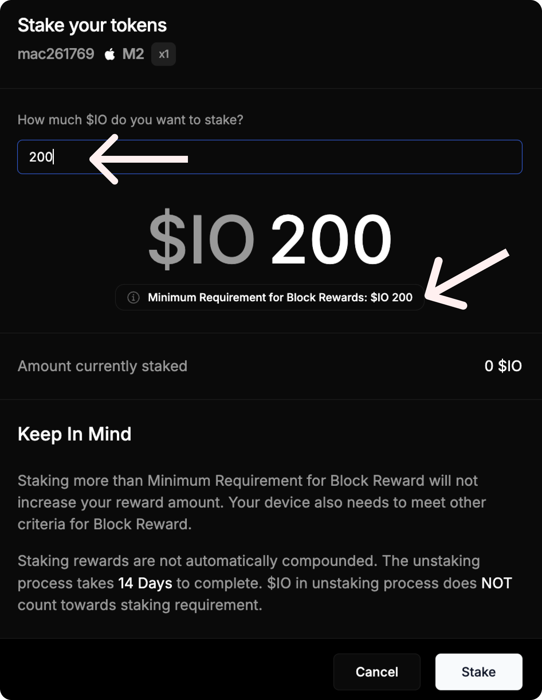

# How to Stake $IO


The amount of block rewards **does not depend** on the amount of tokens staked. The main thing is to stake the minimum required amount of tokens.

[Learn more about the minimum stake calculation.](calculation.md)


## How to Stake IO

1. Open the [**Staking**](https://worker.io.net/worker/integrated-staking) tab on the website.

<figure><figcaption></figcaption></figure>

2. Connect your Solana wallet. I recommend Phantom.

<figure><figcaption></figcaption></figure>

3.  Below, on this page, you'll see a table with connected workers. Next to the desired worker, click **Stake**.

    <figure><figcaption></figcaption></figure>
4.  Enter the required minimum stake and click **Stake** again.

    <figure><figcaption></figcaption></figure>
5. Sign the transaction in your wallet. If an error occurs, try using the Phantom wallet.

As a result, you will see that the tokens have been successfully staked.

<figure><figcaption></figcaption></figure>
