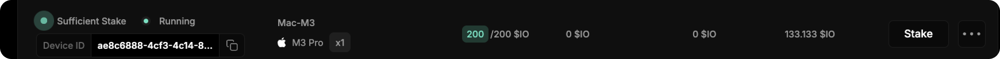

# Как застейкать $IO

## Как застейкать IO

1. Откройте вкладку [**Staking**](https://worker.io.net/worker/integrated-staking) на сайте.

<figure><figcaption></figcaption></figure>

2. Подключите свой Solana-кошелек. Рекомендую Phantom.

<figure><figcaption></figcaption></figure>

3.  Ниже, на этой странице, будет отображаться таблица с подключенными воркерами. Рядом с нужным воркером нажмите **Stake**.

    <figure><figcaption></figcaption></figure>
4.  Введите необходимую минимальную ставку и снова нажмите **Stake**.

    <figure><figcaption></figcaption></figure>
5. Подпишите транзацию в кошельке. Если возникает ошибка, попробуйте через Phantom кошелек.

В результате вы увидите, что токены застейкались.&#x20;

<figure><figcaption></figcaption></figure>
