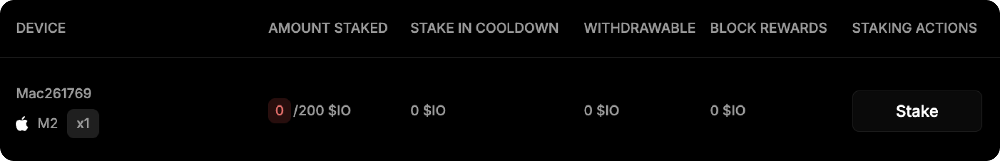

# Как застейкать $IO

## Как застейкать IO&#x20;

1. Откройте вкладку **Staking** на сайте.

<figure><figcaption></figcaption></figure>

2. Подключите свой Solana-кошелек. Если появляется ошибка, попробуйте через Phantom.

<figure><figcaption></figcaption></figure>

3.  Ниже, на этой странице, будет отображаться таблица с подключенными воркерами. Рядом с нужным воркером Нажмите **Stake**.

    <figure><figcaption></figcaption></figure>

4.  Введите необходимую минимальную ставку и снова нажмите **Stake**.

    <figure><figcaption></figcaption></figure>

5. Подпишите транзацию в кошельке.
