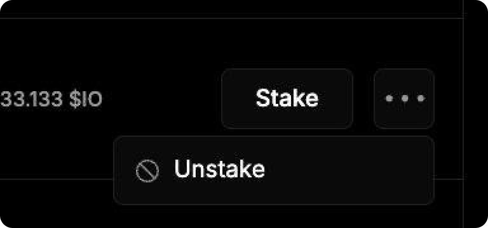

# Как вывести $IO


После того, как вы захотите вывести средства, у вас будет идти 14-дневный период, в течение которого вы не будете получать блок реварды и не сможете рестейкнуть.


1. Откройте вкладку [**Staking**](https://worker.io.net/worker/integrated-staking) на сайте.

<figure><figcaption></figcaption></figure>

2. Ниже, на этой странице, будет отображаться таблица с подключенными воркерами.&#x20;

<figure><figcaption></figcaption></figure>

3. Рядом с нужным нажмите **Три точки → Unstake.**

<figure><figcaption></figcaption></figure>

4. Выводить нужно на тот же кошелек, с которого стейкали. После этого начнется 14-дневный период вывода средств. В течение этого времени вы не будете получать блок реварды и не смоежете рестейкнуть для этого воркера.
