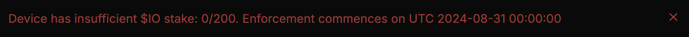

# Про стейкінг для воркерів $IO

### Навіщо стейкати IO

У контексті io.net стейкінг — це застава для отримання блок ревардів. До впровадження стейкінгу блок реварди отримували всі підтримувані пристрої.

Тепер для отримання блок ревардів потрібно застейкати необхідну суму IO, яка залежить від множника і кількості карт в одному воркері.


Зараз io.net запускає стейкінг тільки для воркерів. Пізніше обіцяють зробити для всіх.



Блокові нагороди будуть нараховуватися без стейка до 31 серпня.&#x20;


<figure><figcaption></figcaption></figure>

Оберіть цікавий для вас розділ:


[how-stake.md](how-stake.md)



[unstake.md](unstake.md)



[calculation.md](calculation.md)



[faq.md](faq.md)


## Офіційна документація

* [Блок реварди](https://docs.io.net/docs/block-rewards)
* [Стейкінг](https://docs.io.net/docs/io-staking)
* [Таблиця з множниками і мінімальною ставкою](https://docs.io.net/docs/proposed-device-block-reward-multiplier)
