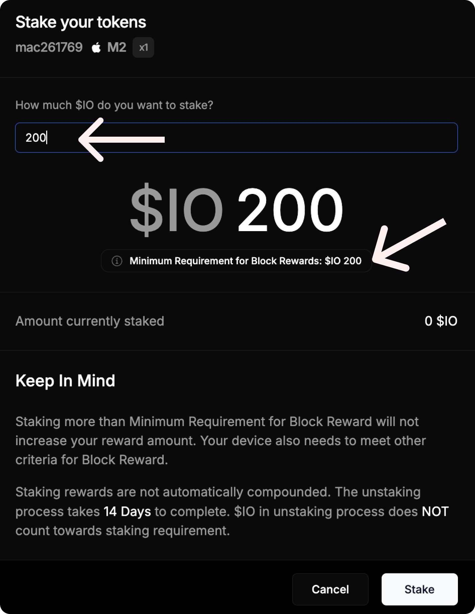

icon: lock
description: Детальний гайд
---

# Як застейкати $IO


Кількість блок ревардів **не залежить** від застейканої суми токенів. Головне, щоб ви застейкали мінімальну суму токенів.&#x20;

[Докладніше про розрахунок мінімальної ставки.](calculation.md)


## Як застейкати IO

1. Відкрийте вкладку [**Staking**](https://worker.io.net/worker/integrated-staking) на сайті.

<figure><figcaption></figcaption></figure>

2. Підключіть свій Solana-гаманець. Рекомендую Phantom.

<figure><figcaption></figcaption></figure>

3.  Нижче, на цій сторінці, відображатиметься таблиця з підключеними воркерами. Поруч з потрібним воркером натисніть **Stake**.

    <figure><figcaption></figcaption></figure>
4.  Введіть необхідну мінімальну ставку і знову натисніть **Stake**.

    <figure><figcaption></figcaption></figure>
5. Підпишіть транзакцію в гаманці. Якщо виникає помилка, спробуйте через Phantom гаманець.

В результаті ви побачите, що токени застейкалися.&#x20;

<figure><figcaption></figcaption></figure>
