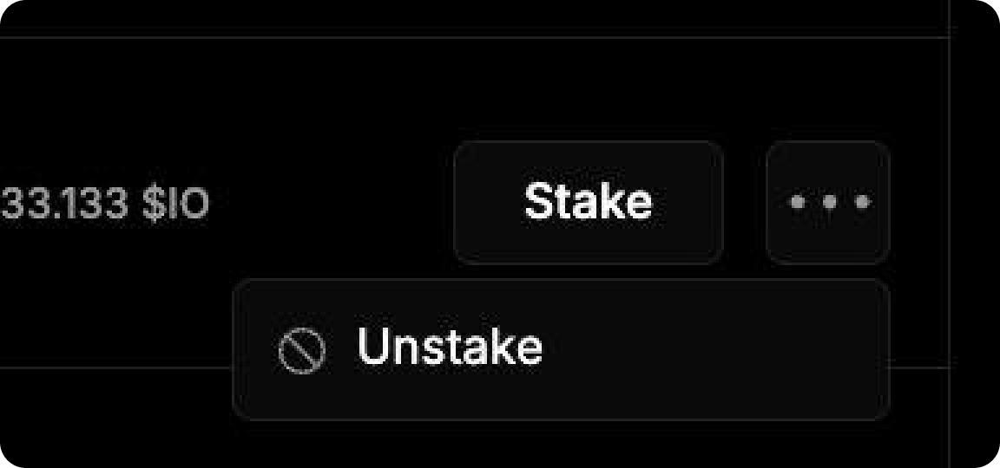

# Як вивести $IO


Після того, як ви захочете вивести кошти, у вас буде проходити 14-денний період, протягом якого ви не будете отримувати блок реварди і не зможете рестейкнути.


1. Відкрийте вкладку [**Staking**](https://worker.io.net/worker/integrated-staking) на сайті.

<figure><figcaption></figcaption></figure>

2. Нижче, на цій сторінці, буде відображатися таблиця з підключеними воркерами.&#x20;

<figure><figcaption></figcaption></figure>

3. Поруч з потрібним натисніть **Три точки → Unstake.**

<figure><figcaption></figcaption></figure>

4. Виводити потрібно на той же гаманець, з якого стейкали. Після цього почнеться 14-денний період виводу коштів. Протягом цього часу ви не будете отримувати блок реварди і не зможете рестейкнути для цього воркера.
